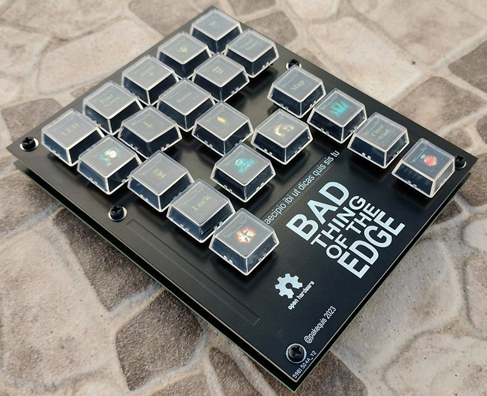
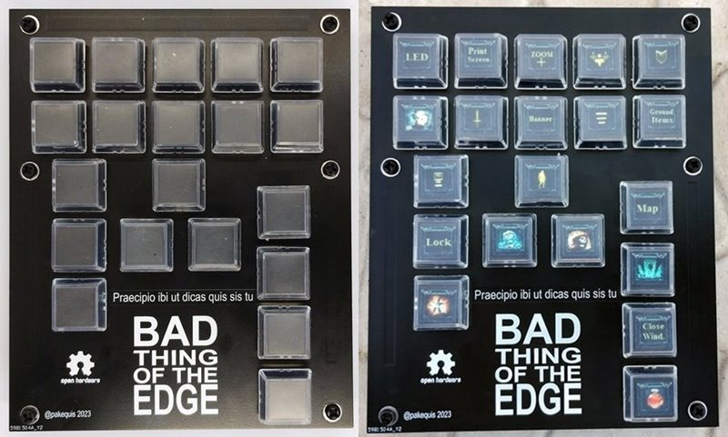
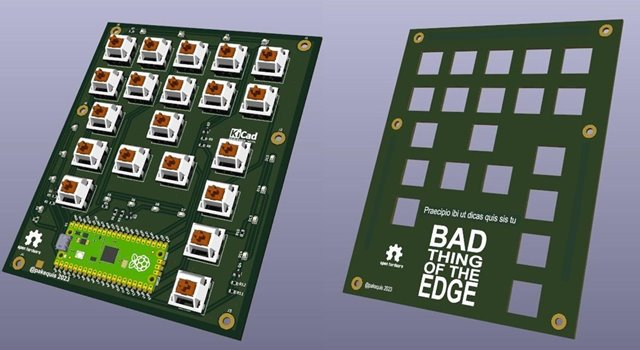
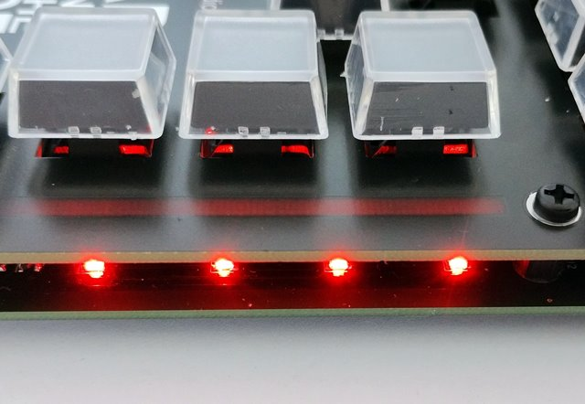
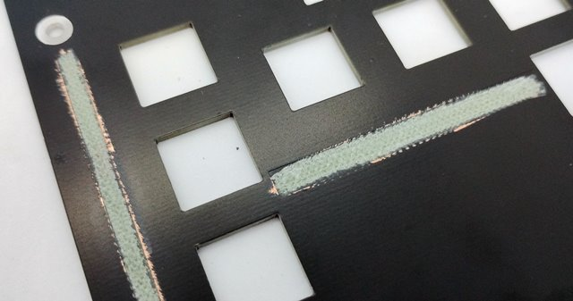
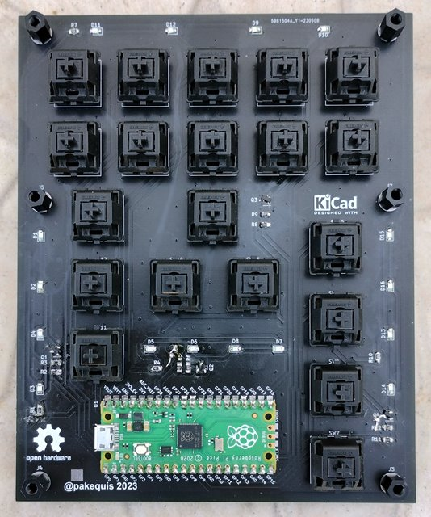

# **Bad Thing of the Edge keyboard**
A mechanical gamer keyboard for left hand with Raspberry Pi Pico.

## Why another mechanical keyboard?

Sometimes I play **Diablo 3** on my small 7-inch laptop and have difficulty with the keyboard. The keys are very small and the placement is a little different from a regular keyboard. Yes, I could remap the keys or use a regular keyboard, but it wouldn't be as fun as making my own keyboard.

The keyboard layout was made for my left hand with the main four fingers on the skills buttons and the thumb on the potion button.

It should work for Diablo 4 (the action keys are mostly in the same positions), but I haven't tested it yet (**$$$**). For other games, you need to change the buttons table in the firmware.

## Demo video:
[

## Hardware:

The boards were developed in kicad 7.0. There are two PCBs, one for the keyboard (Main-board) and another for the panel. The two boards are stacked and secured with M3 screws and 8 mm spacers.

External libraries used in the project::
[Key Switchs library for Kicad by Rafael Silva.](https://github.com/kiswitch/kiswitch)
[Raspberry Pi Pico by Nicolò Carandini.](https://github.com/ncarandini/KiCad-RP-Pico)

I used two-piece clear keycaps for the keys ([bought on Aliexpress](https://s.click.aliexpress.com/e/_DEuJarX) - **Affiliate link!**). I printed the button images, cut them out and put them inside the keycaps.

Bars for the LEDs were made into the panel board with keep out areas on the top and bottom copper layers and the bottom solder mask layer. When the LEDs on the main board turn on, the light is scattered on these bars. I used red LEDs to contrast with the black solder mask and match the horror theme of the keyboard.

The stack:

Mechanical keys are Cherry MX type, but in the prototype I took the keys from a old PTZ camera controller.

Files here are from the second version of the boards, with corrections made to the prototype. The photos and videos are from the prototype. One problem I had with the prototype panel board was that I didn't put the keep out area on the bottom solder mask layer. So I had to sand these areas and the effect was even better than I expected. Here the affected area:

## Firmware:

The firmware was made in [VSCode](https://code.visualstudio.com/) with the [PlatformIO](https://platformio.org/) extension and the [Arduino-Pico core](https://github.com/earlephilhower/arduino-pico), using [Adafruit's TinyUSB library](https://github.com/adafruit/Adafruit_TinyUSB_Arduino). Core 0 is responsible for the keyboard and Core 1 for the LED effects. It was a bit over the top, but I wanted to test this functionality.

The keyboard part was made using the [example from Adafruit's TinyUSB library](https://github.com/adafruit/Adafruit_TinyUSB_Arduino/blob/master/examples/HID/hid_boot_keyboard/hid_boot_keyboard.ino).

The LED effects in this first version are:
- **Breath** - Up and down the bright of the LED bars.
- **Noise** - Random change in the bright of the bars.
- **Breath 2** - Same as the first one, but the center bar changes the brightness first.
- **Keypress** - Flashes the bars when a key is pressed.
- **Quake Flicker** - The classical [fluorescent Quake's flashing lights](https://github.com/Pakequis/arduino-quake-flicker-lamp).

One of the keys - the first one on the top - was exclusive to change the effect of the LEDs. When it is pressed, the bars flash indicating the change and the new effect starts working. Effects are saved in one byte of the FLASH memory and retrieved on power on.

## Bad Thing of What?
The name comes from a famous Brazilian case of haunted house and exorcism that happened in 1953. On one of the exorcism nights, Father Pedro Cintra asked in Latin: **"Praecipio ibi ut dicas qui sis tu"** ("I command you to tell me who you are"). A monstrous voice then replied in Portuguese: **"Eu sou o Diabo!"** ("I am the Devil!").

But people didn't pronounce that name and called the entity just **"Coisa Ruim"** (Bad Thing) when the rumors spread. They added part of the name of the city where the case took place, **Borda da Mata** (something like "Edge of the Woods"), and started to call it Coisa Ruim da Borda (Bad Thing of the Edge).

I found an [article in a magazine of the time with a picture of the haunted house](http://memoria.bn.br/DocReader/DocReader.aspx?bib=003581&pagfis=86382) (in Portuguese - page 102).

## Known issues:
- The position of the Raspberry pi pico on the board is not good and some USB cables may not fit between the boards.
- It lacks a case for 3D printing. 
- The positioning of the LEDs could be improved.

## Contact:

Feel free to reach out to me on social media: @pakequis in any of them...

You can also send me an email at pakequis (Gmail).

